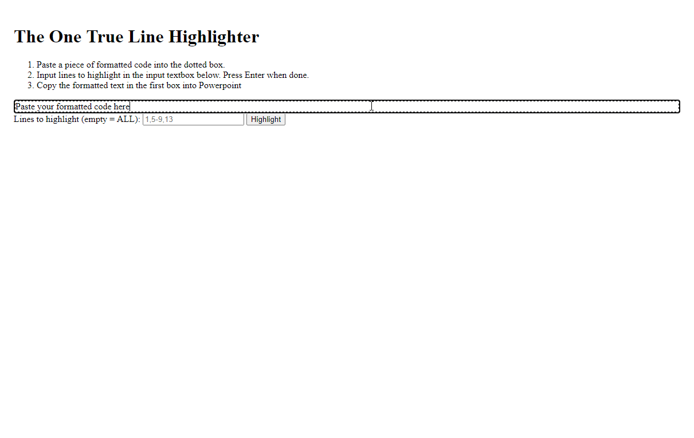
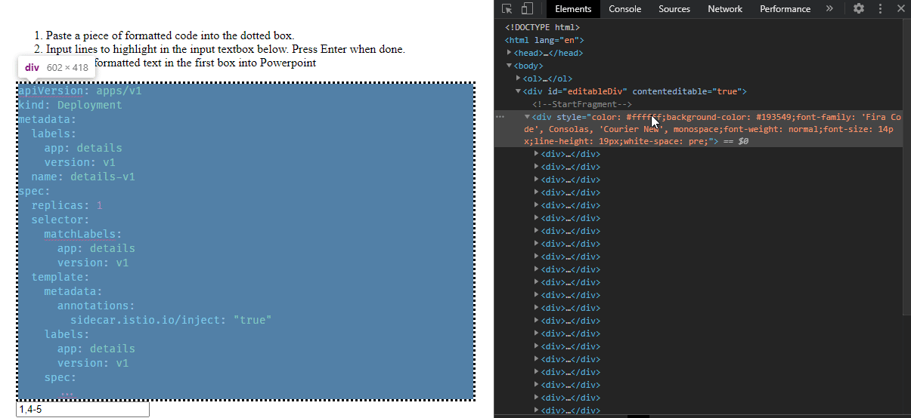
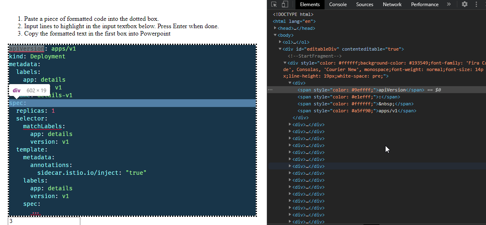

# Purpose

This project highlights specific lines of interest in a code snippet. The result can be copy/pasted back into a Powerpoint slide with the resulting highlight.

## How it works

Have a look through `dimUnwantedText()` in `index.html`. The code goes over each token of a unwanted line and reduce the opacity by 0.5. Since Powerpoint won't accept reduced opacity of texts, the code is changing the text's colour to an equivalent color that resembles the same color at 0.5 opacity.

The corresponding GIFs mentioned are as below:

**1.gif**

**2.gif**

